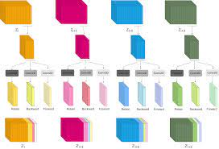
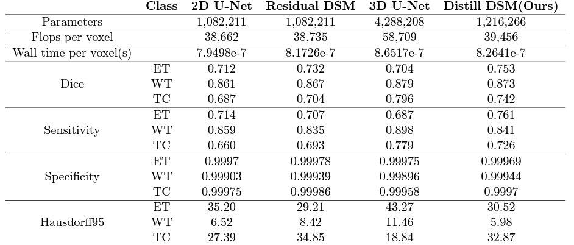

# Distill DSM:Computationally efficient method for segmentation of medical imaging volumes

Accurate segmentation of volumetric scans like MRI and CT scans is highly demanded for surgery planning in clinical practice, quantitative analysis, and identification of disease. However, accurate segmentation is challenging because of the irregular shape of given or- gan and large variation in appearances across the slices. In such problems, 3D features are desired in nature which can be extracted using 3D convolutional neural network (CNN). However, 3D CNN is compute and memory intensive to implement due to large number of parameters and can easily over fit, especially in medical imaging where training data is lim- ited. In order to address these problems, we propose a distillation-based depth shift module (Distill DSM). It is designed to enable 2D convolutions to make use of information from neighbouring frames more efficiently. Specifically, in each layer of the network, Distill DSM learns to extract information from a part of the channels and shares it with neighbouring slices, thus facilitating information exchange among neighbouring slices. This approach can be incorporated with any 2D CNN model to enable it to use information across the slices with introducing very few extra learn-able parameters. We have evaluated our model on BRATS 2020, heart, hippocampus, pancreas and prostate dataset. Our model achieves better performance than 3D CNN for heart and prostate datasets and comparable perfor- mance on BRATS 2020, pancreas and hippocampus dataset with simply 28% of parameters compared to 3D CNN model.

())

Above module represents Distill DSM, in which from a part of feature channels of every slice, three kinds of information are extracted. Features to retain, features to pass to forward slice, and features to pass to backward slice. Channels shown with white color in the second row represent zero-padded channels.

BibTeX reference to cite, if you use it:
<pre>
@inproceedings{
maheshwari2021distill,
title={Distill {DSM}: Computationally efficient method for segmentation of medical imaging volumes},
author={Harsh Maheshwari and Vidit Goel and Ramanathan Sethuraman and Debdoot Sheet},
booktitle={Medical Imaging with Deep Learning},
year={2021},
url={https://openreview.net/forum?id=_n48l6YKc6d}
}
</pre>

## Network Architecture
Three components of information are extracted from the part of feature channels which were shifted to neighbouring slices in DSM. Consider a feature map of ith frame Zi  ⊆ RC×h×w where C is the number of channels and h,w is the spatial size. We select αC channels from the end of Zi  where α ∈ [0,1] and distill the information stored into three components as follows: 
1) Ri  ⊆ RαC2 ×h×w: Necessary information to retain in Zi 
2) Fi  ⊆ RαC4 ×h×w: Necessary information to pass to forward slice Zi+1 
3) Bi  ⊆ RαC4 ×h×w: Necessary information to pass to backward slice Zi−1 .
 
In order to calculate the distilled information(Ri, Fi, Bi) we use a convolution layer for each of them. Now the retained information (Ri ) from current slice, forward information(Fi+1 ) and backward information (Bi−1 ) from the next and previous slice respectively are concatenated to the channels of current slice Zi .
 
 ## Results
 Quantitative segmentation results of 2D U-Net, 3D U-Net, Residual DSM and Distill DSM on BRATS 2020 dataset. ET represents Enhancing Tumor, WT represents Whole Tumor and TC represents Tumor Core

 
 Ablation experiments for α hyper parameter

 Quantitative segmentation results of 2D U-Net, 3D U-Net, Residual DSM and Distill DSM on heart, hippocampus, prostate and pancreas segmentation dataset from medical segmentation decathlon dataset

 ## Trained Models
Download .pth checkpoint for Distill DSM model with the following 
<pre>Note: The ONNX and IR representation models accepts inputs of fixed size mentioned in configuration file. This needs to be updated based on the input size.</pre>

 ## System Specifications
 * Ubuntu 20.04
 * Python 3.8
 * NVidia GPU for training
 * 16 GB RAM for inference

## Code and Directory Organisation
<pre>
distilldsm_rak/
	configs/
       data_split.json
       download_configs.json
       model_configs.json
    media/
       image.png
       Results_1.png
       Results_2.png
       Results_3.png
    src/
       utils/
        dataloader.py
        dataprep.py
        distill_dsm.py
        downloader.py
        exporter.py
        get_config.py
        inference_utils.py
        train_main.py
       export.py
       inference.py
       train.py
	tests/
       test_export.py
       test_inference.py
       test_train.py
	init_venv.sh
	README.md
	requirements.txt
	setup.py
    </pre>

## Code Structure
1. train.py in src directory contains the code for training the model.

2. inference.py in src directory contains the code for evaluating the model with test set.

3. export.py in src directory generating the ONNX and Openvino IR of the trained model.

4. All dependencies are provided in **utils** folder.

5. **tests** directory contains unit tests.

6. **config** directory contains model configurations for the network.

## Run Tests
Necessary unit tests have been provided in the tests directory. The sample/toy dataset to be used in the tests can also be downloaded from .